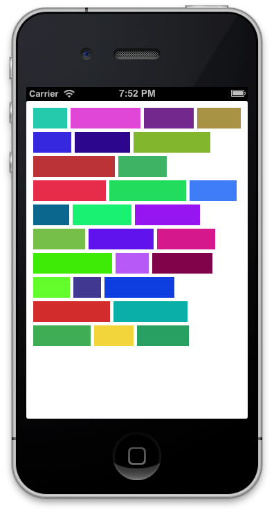
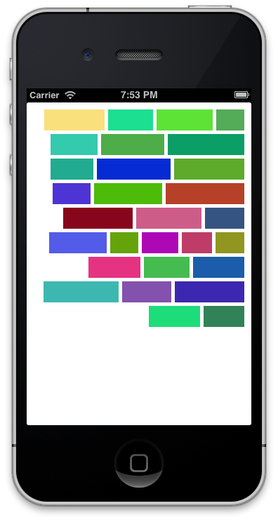

NHAlignmentFlowLayout
=====================

A UICollectionViewFlowLayout sublass that allows you to set the alignment instead of being only justified.

Here is what the default flow layout looks like with:


Here is a left or right aligned NHAlignmentFlowLayout looks like:

 

UIFlowLayout defaults to a justified layout with no way to change this behavior. NHAlignmentFLowLayout comes to fill this need allowing you to set the alignment to left or right (in a vertical scrolling layout) and top or bottom (in a horizontal scrolling layout).

NHAlignmentFlowLayout makes one of the edges of your Cells aligned and keep a constant distance between all cells on one row.

NHAlignmentFLowLayout requires iOS 6 minimum and ARC.

##Usage

Create the NHAlignmentFlowLayout as you would create a UICollectionViewFlowLayout and set it's alignment property.

``` objective-c
NHAlignmentFlowLayout *layout = [[NHAlignmentFlowLayout alloc] init];
layout.scrollDirection = UICollectionViewScrollDirectionVertical;
layout.alignment = NHAlignmentTopLeftAligned;
layout.itemSize = CGSizeMake(90.0, 90.0);
layout.minimumInteritemSpacing = 5.0;
layout.minimumLineSpacing = 5.0;
	
self.collectionView.collectionViewLayout = layout;
```

There are 3 possible values for the alignment property:

- `NHAlignmentJustified` : this is the default value and is the standard flow layout.
- `NHAlignmentTopLeftAligned` : this is top-aligned for a horizontally scrolling layout and left-alined for a vertically scrolling layout. 
- `NHAlignmentBottomRightAligned` : this is bottom-aligned for a horizontally scrolling layout and right-alined for a vertically scrolling layout. 

##Adding NHAlignmentFlowLayout to your project

NHAlignmentFlowLayout is available on [CocoaPods](http://cocoapods.org). Add the following line to your `Podfile`:

``` ruby
pod 'NHAlignmentFlowLayout'
```
and then run `pod install` to install the dependency.

